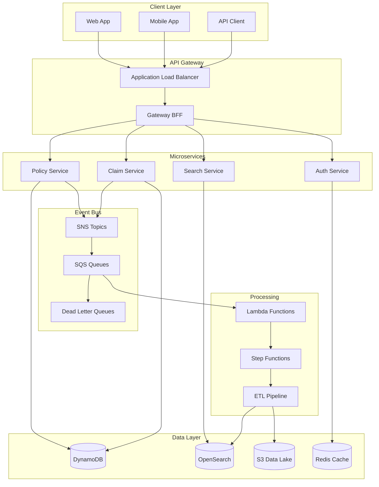

# Insurance Data Platform - Architecture

## Overview

The Insurance Data Platform is a production-ready microservices architecture built on AWS, designed to handle policy and claims management with event-driven data processing and real-time search capabilities.

## Architecture Principles

- **Database-per-service**: Each microservice owns its data
- **Event-driven**: Asynchronous communication via SNS/SQS
- **API Gateway**: Single entry point with rate limiting and circuit breakers
- **Observability**: Distributed tracing, structured logging, and metrics
- **Security**: JWT authentication, IAM least-privilege, secrets management
- **Resilience**: Circuit breakers, retries, dead letter queues

## System Architecture



## Microservices

### Policy Service (Port 8001)
- **Purpose**: Manage insurance policies
- **Database**: DynamoDB `policy-svc_policies`
- **Events**: `PolicyCreated`, `PolicyUpdated`
- **Endpoints**:
  - `POST /policies` - Create policy
  - `GET /policies/{policyId}` - Get policy
  - `GET /customers/{customerId}/policies` - List customer policies

### Claim Service (Port 8002)
- **Purpose**: Manage insurance claims with idempotency
- **Database**: DynamoDB `claim-svc_claims`
- **Events**: `ClaimCreated`, `ClaimUpdated`
- **Features**: Idempotency key support, outbox pattern
- **Endpoints**:
  - `POST /claims` - Create claim (with idempotency)
  - `GET /claims/{claimId}` - Get claim
  - `GET /policies/{policyId}/claims` - List policy claims

### Search Service (Port 8005)
- **Purpose**: Full-text search across policies and claims
- **Database**: OpenSearch
- **Features**: Multi-field search, faceted search, ILM
- **Endpoints**:
  - `GET /search?q=...` - Search across all data

### Gateway BFF (Port 8000)
- **Purpose**: API composition and orchestration
- **Features**: Rate limiting, circuit breakers, API composition
- **Endpoints**:
  - `GET /api/dashboard` - Customer dashboard
  - `GET /api/search` - Unified search
  - `GET /api/policies` - Policy management
  - `GET /api/claims` - Claim management

### Auth Service (Port 8003)
- **Purpose**: Authentication and authorization
- **Features**: JWT token generation, user management
- **Endpoints**:
  - `POST /auth/token` - Generate access token

## Data Flow

### Synchronous Flow
1. Client sends request to API Gateway
2. Gateway validates authentication
3. Gateway routes to appropriate microservice
4. Microservice processes request and updates database
5. Microservice publishes event to SNS
6. Response returned to client

### Asynchronous Flow
1. Microservice publishes event to SNS
2. SNS delivers to SQS queues
3. Lambda functions process events
4. Step Functions orchestrate ETL pipeline
5. Data written to S3 and indexed in OpenSearch

## Event Contracts

All events follow a standardized schema:

```json
{
  "eventId": "uuid",
  "eventType": "PolicyCreated|ClaimCreated|...",
  "eventVersion": 1,
  "occurredAt": "2024-01-01T00:00:00Z",
  "traceId": "opentelemetry-trace-id",
  "data": { /* event-specific data */ }
}
```

## Security

- **Authentication**: JWT tokens (stub for local, Cognito-ready)
- **Authorization**: Service-level permissions
- **Network**: VPC, security groups, private subnets
- **Data**: Encryption at rest and in transit
- **Secrets**: AWS Secrets Manager

## Observability

- **Tracing**: OpenTelemetry with W3C Trace Context
- **Logging**: Structured JSON logs with correlation IDs
- **Metrics**: Custom business metrics and system metrics
- **Health Checks**: Liveness and readiness probes

## Local Development

The platform includes a complete local development environment:

- **LocalStack**: AWS services simulation
- **OpenSearch**: Search engine
- **Redis**: Caching and circuit breaker state
- **Docker Compose**: Service orchestration

### Quick Start

```bash
# Start all services
make compose:up

# Bootstrap AWS resources
make bootstrap

# Run demo with sample data
make demo

# Run tests
make test
```

## Deployment

### Infrastructure as Code
- **Terraform**: Modular infrastructure definitions
- **Environments**: dev, staging, production
- **State Management**: Remote state with locking

### CI/CD Pipeline
1. **Lint & Type Check**: Code quality validation
2. **Test**: Unit and integration tests
3. **Build**: Docker image creation
4. **Scan**: Security vulnerability scanning
5. **Deploy**: Terraform apply for infrastructure

## Monitoring and Alerting

- **Application Metrics**: Response times, error rates, throughput
- **Infrastructure Metrics**: CPU, memory, disk, network
- **Business Metrics**: Policy creation rate, claim processing time
- **Alerts**: PagerDuty integration for critical issues

## Disaster Recovery

- **Backup**: Automated DynamoDB backups
- **Replication**: Cross-region data replication
- **Recovery**: RTO < 4 hours, RPO < 1 hour
- **Testing**: Quarterly DR drills

## Performance

- **Latency**: P95 < 200ms for API calls
- **Throughput**: 1000+ requests/second per service
- **Availability**: 99.9% uptime SLA
- **Scalability**: Auto-scaling based on metrics

## Cost Optimization

- **Right-sizing**: Regular instance optimization
- **Reserved Instances**: For predictable workloads
- **Spot Instances**: For batch processing
- **Data Lifecycle**: Automated data archival

## Future Enhancements

- **Machine Learning**: Fraud detection, risk assessment
- **Real-time Analytics**: Stream processing with Kinesis
- **Multi-tenancy**: Tenant isolation and data segregation
- **API Versioning**: Backward compatibility management
